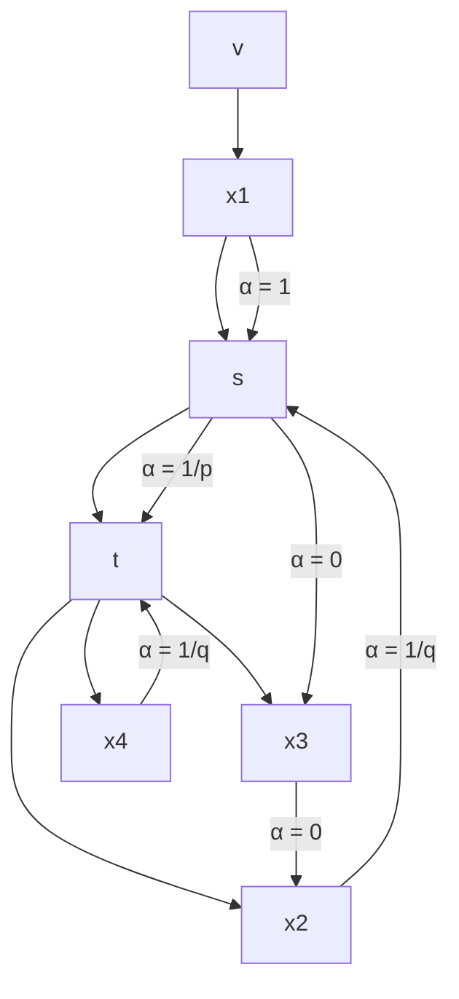

# A Graph-based Approach for Trajectory Similarity Computation in Spatial Networks

Peng Han  
King Abdullah University of Science and Technology  
peng.han@kaust.edu.sa

Jin Wang
University of California, Los Angeles
jinwang@cs.ucla.edu

Di Yao
Institute of Computing Technology,
Chinese Academy of Sciences
yaodi@ict.ac.cn

Shuo Shang\*  
University of Electronic Science and Technology of China  
jedi.shang@gmail.com

Xiangliang Zhang \(^{*}\) King Abdullah University of Science
and Technology
xiangliang.zhang@kaust.edu.sa

## ABSTRACT

Trajectory similarity computation is an essential operation in many applications of spatial data analysis. In this paper, we study the problem of trajectory similarity computation over spatial network, where the real distances between objects are reflected by the network distance. Unlike previous studies which learn the representation of trajectories in Euclidean space, it requires to capture not only the sequence information of the trajectory but also the structure of spatial network. To this end, we propose GTS, a brand new framework that can jointly learn both factors so as to accurately compute the similarity. It first learns the representation of each point-of-interest (POI) in the road network along with the trajectory information. This is realized by incorporating the distances between POIs and trajectory in the random walk over the spatial network as well as the loss function. Then the trajectory representation is learned by a Graph Neural Network model to identify neighboring POIs within the same trajectory, together with an LSTM model to capture the sequence information in the trajectory. We conduct comprehensive evaluation on several real world datasets. The experimental results demonstrate that our model substantially outperforms all existing approaches.

## CCS CONCEPTS

• Information systems → Traffic analysis.

## KEYWORDS

graph neural networks; spatial network; trajectory similarity

## ACM Reference Format:

Peng Han, Jin Wang, Di Yao, Shuo Shang, and Xiangliang Zhang. 2021. A Graph-based Approach for Trajectory Similarity Computation in Spatial Networks. In Proceedings of the 27th ACM SIGKDD Conference on Knowledge

\*Corresponding Author.

Permission to make digital or hard copies of all or part of this work for personal or classroom use is granted without fee provided that copies are not made or distributed for profit or commercial advantage and that copies bear this notice and the full citation on the first page. Copyrights for components of this work owned by others than ACM must be honored. Abstracting with credit is permitted. To copy otherwise, or republish, to post on servers or to redistribute to lists, requires prior specific permission and/or a fee. Request permissions from permissions@acm.org.

KDD '21, August 14–18, 2021, Virtual Event, Singapore

© 2021 Association for Computing Machinery.

ACM ISBN 978-1-4503-8332-5/21/08...\$15.00

https://doi.org/10.1145/3447548.3467337

Discovery and Data Mining (KDD '21), August 14–18, 2021, Virtual Event, Singapore. ACM, New York, NY, USA, 9 pages. https://doi.org/10.1145/3447548.3467337

## 1 INTRODUCTION

Trajectory similarity computation is a fundamental operation in a wide range of real world applications, such as route planning \([30]\) , trajectory clustering \([33]\) and transportation optimizations \([25]\) . A Trajectory describes the path traced by bodies moving in space over time \([2]\) , and is usually represented as a sequence of discrete locations. To measure the similarity between two trajectories, many metrics are proposed in previous studies, such as Dynamic Time Warping \([34]\) (DTW), longest common subsequence \([28]\) (LCSS), edit distance with real penalty \([4]\) (ERP) and edit distance on real sequences \([5]\) (EDR). However, these metrics require quadratic computational complexity \(O(n^{2})\) , where n is the average length of trajectories. As a result, the high computation cost of above similarity metrics becomes a serious problem when dealing with massive trajectory data. To resolve such problems, some recent studies \([18, 31, 35]\) utilized neural network based models to learn the representation of trajectories. And the similarity between trajectories could be measured by that of the low-dimensional embedding vectors, which can be finished in linear time.

While above approaches are effective for measuring the trajectory similarity in Euclidean space, they cannot be applied in the problem of trajectory similarity computation over spatial network, such as road network. In many real application scenarios, objects are moving in spatial networks rather than in Euclidean space. In a spatial network, Euclidean distance might lead to errors when calculating the real distance between objects. To better understand the difference between these them, consider the concrete example shown in Figure 1. The Euclidean distance between trajectories \(\tau_{1}\) and \(\tau_{2}\) is smaller than that between \(\tau_{1}\) and \(\tau_{3}\) . But the real distance on the road network between \(\tau_{1}\) and \(\tau_{3}\) is actually much smaller, as there is no passage between \(\tau_{1}\) and \(\tau_{2}\) in the road network.

There are several previous studies \([8, 17, 23]\) focusing on the computation of trajectory similarity over spatial networks. They proposed handcrafted heuristic approaches to align the trajectory to spatial network so as to compute some user defined similarity functions, which still suffer from high computational overhead. However, the difficulty in adopting deep learning based techniques to this problem is two-fold. On the one hand, it is essential to take the

text_image

POI
Road Network
T1
T2
T3

Figure 1: Example of Trajectory Similarity Measurement over Spatial Network

network structure into consideration when learning the trajectory embedding, while existing solutions for Euclidean space \([18, 31, 35]\) only capture the sequence information. On the other hand, the learning process suffers from data sparsity: due to the large problem space which is exponential w.r.t. the number of POIs in the spatial network, the coverage of training data might be insufficient to include all possible combinations. As a result, once a trajectory pattern is infrequent or even missing in the training data, the trained model cannot learn a high-quality embedding for it.

To address above issues, in this paper we propose Graph-based approach for measuring Trajectory Similarity (GTS), a novel framework of trajectory representation learning for similarity computation over spatial networks. GTS consists of three steps, namely measuring trajectory similarity, learning point-of-interest (POI) representation and learning trajectory embedding. We start from the similarity measurement between trajectories, which is the first step towards a robust framework for learning trajectory embedding. To reflect the relationship between trajectories on the road network as well as the inherited properties of each single trajectory, we define the trajectory similarity from three aspects: POI-wise distance, POI-Trajectory distance and Trajectory-wise similarity.

Based on such definitions of trajectory similarity over the spatial network, we then learn the trajectory embedding in the following two steps. We first learn the embedding of each POI in the spatial network, which serves as a cornerstone for the embedding of trajectories. While previous works \([9, 12, 26]\) learn the POI embedding mainly by learning the spatial information, here we need to take the trajectories into consideration along with the topology of spatial network. To this end, we propose a trajectory-aware random walk algorithm and a new loss function to train a skip-gram model such that POIs co-occurring in these random walks would produce similar embeddings.. In the next step, we learn trajectory representation on the basis of such POI embeddings. To overcome the data sparsity problem, we use Graph Neural Network (GNN) to encode the embedding of each POI with its neighbor information.

Then a trajectory becomes a sequence of POIs and we can learn its representation with a Long Short-Term Memory (LSTM) network. In this way, the learned representation will contain richer information of the network structure and thus is capable to reflect various trajectory patterns even if they are not explicitly included in the training data.

The main contributions of this paper are summarized as following:

- We propose a graph-based framework GTS for the problem of trajectory similarity computation over spatial network. To the best of our knowledge, it is the first work to solve this problem with graph-based deep learning techniques.  
- We devise a trajectory-aware random walk algorithm with new sampling strategy to learn embedding of each POI in the spatial network so as to integrate the trajectory information with the network structure.  
- On the basis of that, we further design a GNN-LSTM model which is robust to data sparsity and noisy in given trajectories to learn high-quality trajectory representations.  
- We conduct an extensive set of experiments on popular real-world datasets. The results show that our proposed methods significantly outperform the existing approaches in terms of accuracy.

The rest of the paper is organized as following: Section 2 surveys the related work. Section 3 introduces necessary background knowledge and problem settings. Section 4 and Section 5 proposes the techniques to learn the representation of a single location and the whole trajectory, respectively. Section 6 reports the experimental results. Finally Section 7 concludes the paper.

## 2 RELATED WORK

### 2.1 Non-learning Trajectory Similarity Computation

There are two categories of traditional approaches for trajectory similarity computation. One is grid based similarity, which use distances in Euclidean space. Previous studies in this category rely on the distance aggregation over all points on the trajectory to compute the similarity, such as Dynamic Time Warping \([34]\) (DTW), longest common subsequence \([28]\) (LCSS), edit distance with real penalty \([4]\) (ERP), edit distance on real sequences \([5]\) (EDR) and Hausdorff \([1]\) . They are expensive in computation time even with some optimizations \([21]\) and might suffer from noisy points in trajectories.

The other one is spatial network based similarity, where trajectories are first mapped to the spatial network and then the similarity is computed by applying similarity functions on top of the transformed trajectories. Earlier approaches utilized metrics like shortest path and set-based similarity to describe the similarity between trajectories. Shang et al. [23] proposed a joint similarity function to consider both spatial and temporal similarity as well as several indexing and pruning techniques. Wang et al. [29] defined a new function called Longest Overlapping Road Segments to measure the similarity between two transformed trajectories. Unfortunately, existing road-constrained trajectory measures either suffer from the high computation problem or are too simple to used in real-life applications.

There are many applications regarding trajectory similarity computation. Several previous studies \([6, 22, 24]\) aimed at accelerating the similarity search and join over trajectory data by devising index and pruning techniques. Specifically, tree-based index structures \([5, 8]\) , such as K-D tree or R-tree are employed to organize the trajectories. Then, bounding-box-based pruning techniques are proposed to eliminate unnecessary computations. Zheng et al. \([37]\) studied the problem of inference hidden route from known trajectories. Song et al. \([25]\) focused on the problem of trajectory compression based on road network.

### 2.2 Deep Learning based Approaches

Recently deep learning techniques have been widely adopted to many problems related to spatial data analysis \([12, 13, 36]\) . A comprehensive survey is made in \([2]\) . Some existing studies employ neural network models to learn the representation of trajectories and then compute the similarity by measuring that between the embedding vectors. Li et al. \([18]\) adopted an encoder-decoder architecture to obtain trajectory vector representations. Yao et al. \([31, 32]\) further improved the performance by devising new spatial attention mechanism and using pair-wise distance as guidance for learning. Zhang et al. \([35]\) proposed several new loss functions to improve the quality of learned embedding. All above methods are designed for similarity metrics in Euclidean space and cannot be adopted to our problem as they fail to learn the information from spatial network. Deep learning techniques are also adopted to other trajectory related problems, such as clustering \([33]\) and route prediction \([17]\) , which has different problem settings with our work.

### 2.3 Graph Neural Networks

Recent works on the Graph Neural Network (GNN) [15] have attracted considerable attention, motivating the remarkable success in various graph mining tasks in multiple domains [7, 16]. GNNs originated from the spectral graph convolutional neural networks (GCNs) [3]. Afterwards, Kipf and Welling [15] further extended it for semi-supervised node classification with concise form and achieved great success. Taking account of large-scale networks, Hamilton et al. [11] approximated GCN by an inductive representation learning framework. Later, the attention mechanism was also introduced to adaptively specify the weights during the training process [27]. Our work employed the property of GNN that can obtain neighborhood information of each node in the spatial network so as to overcome the data sparsity problem.

## 3 PRELIMINARY

### 3.1 Trajectory with Spatial Networks

We first formally describe the data model of this paper. The spatial network is represented as a undirected graph \(G = (V, E)\) . In this graph, each node \(v \in V\) is a POI in the spatial network, where the representation of a road intersection or a road end with attributes latitude and longitude. Meanwhile, each edge \(e = \langle v_i, v_j \rangle \in E\) represents the distance between two POIs \(v_i\) and \(v_j\) . A original trajectory \(\tau = \{p_1, p_2, \dots, p_k\}\) is composed with sequential points with latitude and longitude. Then we mapped them into the POI set \(V\) with the nearest distance to generate the corresponding vertex trajectory \(\tau = \{v_{n1}, v_{n2}, \dots, v_{nk}\}\) and the length of a trajectory (denoted as \(|\tau|\) ) is defined as the number of POIs in it.

### 3.2 Similarity Between Trajectories

To develop robust and effective learning techniques, the first step is to make a proper definition of similarity measurement between two trajectories over the road network. Different from previous studies using Euclidean distance, the similarity measurement in our work should not only reflect the property of a trajectory, but also that of the spatial network. To achieve this goal, we define trajectory similarity by considering the distances from two aspects: POI-wise distance and POI-Trajectory distance.

The POI-wise distance is the distance between two POIs over the road network, which is defined as the length of the shortest path between them. Given two POIs \(v_{i}, v_{j} \in V\) , if \(v_{i}\) is reachable from \(v_{j}\) , we use \(d(v_{i}, v_{j})\) to denote the length of shortest path, i.e. the POI-wise distance between them.

Similarly, we can define the POI-Trajectory distance as the shortest distance between the POI and the trajectory. However, the computation of the exact value is very expensive as we need to compute distances between the POI and all segments of this trajectory. To reduce the computation overhead, we define the POI-Trajectory distance as the shortest POI-wise distance between the given POI and all POIs in the trajectory. Although the computational complexity of our definition is the same as that of the original method, the cost is much less in practice since the distances between POIs in our definition could be reused for different trajectories and the amortized cost would be rather low. Then given one POI v and trajectory \(\tau\) , the POI-Trajectory distance \(d(v,\tau)\) from the POI to the trajectory is formulated as Equation (1):

\[
d (v, \tau) = \min _ {v _ {i} \in \tau} d (v, v _ {i}). \tag {1}
\]

Based on above definitions, we then propose the cornerstone of our learning framework: the Trajectory-wise similarity. To make a good similarity metrics, the computation of the Trajectory-wise similarity should have the property of commutativity. Moreover, it should also be negatively correlated to the actual distance between trajectories. Based on above consideration, given two trajectories \(\tau_{1}\) and \(\tau_{2}\) , we formulate the definition of similarity \(\mathrm{Sim}(\tau_{1},\tau_{2})\) between them as Equation (2):

\[
\mathrm{Sim} (\tau_ {1}, \tau_ {2}) = \frac {\sum_ {v _ {i} \in \tau_ {1}} e ^ {- d (v _ {i} , \tau_ {2})}}{| \tau_ {1} |} + \frac {\sum_ {v _ {j} \in \tau_ {2}} e ^ {- d (v _ {j} , \tau_ {1})}}{| \tau_ {2} |}, \tag {2}
\]

### 3.3 Overall Framework

With the definition in Equation (2), we can then formally define the problem of trajectory similarity computation over the road network with learning method formally as Definition 3.1.

Definition 3.1. Given a road network \(G = (V, E)\) and a trajectory set \(\mathbf{T} = \{\tau_1, \tau_2, \dots, \tau_n\}\) , \(\forall \tau_i \in \mathbf{T}\) it aims at finding a trajectory \(\tau_j\) that minimizes \(\operatorname{Sim}(\tau_i, \tau_j)\) and \(i \neq j\) .

To address this problem, we propose a two-step framework GTS shown in Figure 2. Comparing with the end-to-end model architecture, the advantage of a two-step framework is that the training process is more stable and interpretable. The two steps will be detailed in Section 4 and 5, respectively.

  
Figure 2: Overall Framework of GTS

There are mainly three challenges in the construction of trajectory similarity measurement model.

- The first one is how to utilize the information of spatial network in the perspective of trajectory, which could be different from grid-based methods.  
- Moreover, how to represent the trajectory should be considered carefully, as the trajectory representations is closely related to the computation of trajectory similarity.  
- Finally, how to design the objective function will directly influence the performance of the framework, which should be designed based on the characteristics of the collected trajectory dataset.

## 4 POI REPRESENTATION LEARNING

In this section, we will introduce a new framework TraNode2Vec for learning the POI representation over road network. We first give the big picture of the learning objective in Section 4.1 and then provide more technique details in Section 4.2.

### 4.1 Objective Function

Since we targeted at learning trajectory similarity over road network, the first step is to learn a high-quality presentation of POIs in the network. To this end, the learning objective should be with physical significance so as to include the information of trajectories into the POI representation. Unlike previous studies that utilized feature engineering methods based on the expert knowledge, in our work we aim at learning trajectory-aware POI embedding via the distance and similarity functions defined in Section 3. As a result, our approach can not only learn the topology of road network but also fit the distribution of existing trajectories.

The first step towards this goal is to design a proper objective function that is consistent with the goal of learning trajectory similarity. According to our definition of Trajectory-wise similarity, it is essential to know the distance between POIs so as to estimate the similarity. Therefore, we aim at identifying a learning objective

to help formulate a representation where the embedding vectors of nearby POIs or belonging to the same trajectories should also be closed with each other. In this target, there are two kinds of relationships between POIs. The first relationship is the topology relationship between POIs in the road network, which will influence the distances between them directly. The second one is whether two POIs belong to the same trajectory. These two relationships could be metaphysically described as the 'neighbors' of POIs, in which we can model them with existing embedding methods that are able to capture the property of neighbors.

To capture the property of ‘neighbors’, we could utilize the well-known Skip-gram [19] approach, which is originated in the field of natural language processing. It has been exploited in many applications to learn the representation of basic building blocks, such as the word embeddings in the article. Given the POI set \(V = \{v_{1}, v_{2}, \ldots, v_{m}\}\) , we could get the Skip-gram objective function for our task as Equation (3)

\[
\max _ {f} \sum_ {v \in V} \log P (N _ {s} (v) | f (v)), \tag {3}
\]

where \(f : v \to R^{d}\) is the encoder to map the POI into d dimension vectors, \(P(\cdot)\) is probability function and \(N_{s}(v) \subseteq V\) is the neighbors of POI v which is obtained via a random walk algorithm described later in Section 4.2. By optimizing this objective function, the learned embedding of given POI will have explicit connection with those of its neighbors.

One limitation of above objective function lies in the aspect of computational efficiency. To resolve this problem, we make a trade-off between the accuracy and efficiency as following: For the given POI v, we assume that all its neighbors in \(N_{s}(v) \subseteq V\) are independent, which can reduce the computational complexity of the function \(P(N_{s}(v)|f(v))\) . Under this assumption, we have the objective function as Equation (4):

\[
P (N _ {s} (v) | f (v)) = \prod_ {v _ {i} \in N _ {s} (v)} P (v _ {i} | f (v)). \tag {4}
\]

Given POIs \(v_{i}\) and v, the value of \(P(v_{i}|f(v))\) satisfies the following conditions: (i) the value of probability should be ranged in [0, 1]; and (ii) the sum of all probabilities for the given POI v should be 1. Thus we employ the softmax function that has been widely used to compute the probability in multiple classification problems. Then we have the explicit formulation of \(P(v_{i}|f(v))\) as Equation (5)

\[
P (v _ {i} | f (v)) = \frac {e ^ {f (v _ {i}) \cdot f (v)}}{\sum_ {v _ {j} \in V} e ^ {f (v _ {j}) \cdot f (v)}}. \tag {5}
\]

However, the computation of \(\sum_{v_{j}\in V}e^{f(v_{j})\cdot f(v)}\) is time-consuming in the training process. The reason is that function \(f(\cdot)\) will be updated after every epoch and the computation \(\sum_{v_{j}\in V}e^{f(v_{j})\cdot f(v)}\) cannot be reused. To solve this problem, the negative sampling method could be utilized to reduce the computation time by pairwise loss.

### 4.2 Finding Neighbors

Next we discuss how to generate the compute the set of neighbors \(N_{s}(v)\) of given POI v in the objective function. Previous network embedding approaches, such as node2vec [10], find such neighbors by a random walk algorithm based on the topology structure of the graph. However, in our work we need to not only consider the topology structure of the road network but also the given existing trajectories.

To address this issue, we employ a random walk algorithm to find \(N_{s}(v)\) for given POI v the topology structure of the road network. Given a starting POI v and the length of walks \(n_{w}\) , the random walks method will generate a random path with starting POI v and \(n_{w}\) nodes. The generation process is proceeded node-wise, and every node in the path is depended on previous nodes. With the starting node \(c_{0}=v\) , we generate the i-th node \(c_{i}\) for the random path as Equation (6):

\[
P (c _ {i} = x | c _ {i - 1} = s) = \left\{ \begin{array}{l l} \frac {\pi_ {s x}}{Z} & \text {if} (s, x) \in E, \\ 0 & \text {otherwise}, \end{array} \right. \tag {6}
\]

where \(\pi_{sx}\) is the transition probability from s to x and Z is a normalization constant.

As our goal is to learn a trajectory-aware POI representation, we need to reflect the influence of existing trajectories in the definition of transition probability in random walks. The probability of next node in previous approaches such as node2vec is only decided by the node visited in the previous two steps. While this approach can capture the topology structure of the graph, it fails to take the trajectories into consideration in our problem setting. To ensure whether two POIs are in the same trajectory, we need to devise a random walk algorithm where the transition probability in each step is also influenced by the starting node of a trajectory.

To reach this goal, a straightforward solution for that is via a sampling based method. Instead of only considering the previous two nodes, we choose the next node according to both the previous two nodes and starting node. The relationship between the next and previous two nodes could keep the topology structure of the graph. And the trajectory information will be maintained in the connection between the next and starting nodes.

Assuming that the random walk just visited the edge \((t, s)\) with current node s, we define the transition probability as \(\pi_{sx} = \alpha(t, x) \cdot\)

flowchart

Figure 3: Illustration of our random walk.

\(e^{-d(s,x)}\) , where the distance in the road network between POIs s and x is incurred in the term \(d(s,x)\) . And \(\alpha(t,x)\) is probability of sampling defined in Equation (7):

\[
\alpha (t, x) = \left\{ \begin{array}{l l} \frac {1}{p} & \text {if} d _ {t x} = 0 \text {and} \{v, x \} \tilde {\in} \tau \\ 1 & \text {if} d _ {t x} = 1 \text {and} \{v, x \} \tilde {\in} \tau \\ \frac {1}{q} & \text {if} d _ {t x} = 2 \text {and} \{v, x \} \tilde {\in} \tau \\ 0 & \text {otherwise}, \end{array} \right. \tag {7}
\]

where \(d_{tx}\) is the path containing the least number of POIs between t and x, and the operation \(\{v,x\}\tilde{\in}\tau\) means there is one trajectory \(\tau\in T\) that \(x\in\tau\) and \(v\in\tau\) . The illustration of this process could be found in Fig. 3.

In this way, we can ensure that all nodes in the path have direct connection with the starting node v. Moreover, the topology structure of the road network could also be maintained in our sampling method.

## 5 GRAPH-BASED TRAJECTORY EMBEDDING

In this section, we introduce how to learn the trajectory embedding based on the POI representation learned previously.

### 5.1 GNN-based Representation

Although the POI representation has captured certain information from the spatial network, we still need to incorporate it in the process of learning trajectory embedding. The reason is that we need the information of spatial network from different aspects: In the process of POI representation learning, the spatial network is exploited to make the embedding of connected POIs in the spatial network similar; while in the process of learning trajectory embedding, we need more information about node connections from the spatial network so as to make the trajectory representation more stable and robust.

The main challenge of the trajectory representation is that the search space is the enumeration of combination among all POIs. As a result, we cannot get sufficient training instances to cover all possible trajectory patterns and thus it results in the data sparsity problem. To overcome this problem, we could utilize graph neural networks (GNN) to incorporate more information from the spatial network into each trajectory. The reason that we employ GNN here is that its Laplacian regularization term in the objective function

of GNN could make the connected nodes keep the same labels and thus help alleviate the sparsity problem. More specifically, the computation of GNN incurs the information of neighbors for the given node.

In our task, we can deal with the sparsity by utilizing more POIs with the same set of trajectories. With the help of GNN, for each POI in one trajectory, we could impose its neighboring POIs to generate trajectory embedding. In this way, there will be a larger number of common POIs between similar trajectories. And for a given trajectory, it is easier to find the most similar trajectory in the training set to satisfy our goal in Definition 3.1.

To this end, we build the graph based on the POIs imposed for each POI in the trajectory as the input graph for GNN. Meanwhile, we could use the spatial network to construct the adjacent graph for GNN where only POIs that in the spatial network will be connected in the adjacent graph. In this way, we could directly incorporate the spatial network to compute the trajectory representation.

Given the POIs \(V = \{v_{1}, v_{2}, \ldots, v_{m}\}\) and weights set E, we could construct the adjacent graph G as Equation (8):

\[
G _ {i j} = \left\{ \begin{array}{l l} 1 & \text {if} (v _ {i}, v _ {j}) \in E \\ 0 & \text {otherwise.} \end{array} \right. \tag {8}
\]

This adjacent graph \(G\) will be symmetric with diagonal element zeros.

Nevertheless, the adjacent graph G in this format still cannot accurately reflect the relationship between POIs. The reason is that values in G are not equal to the influence between the nodes. To address this issue, we construct the Laplacian matrix A in our work with a weight \(\alpha\) to control the influence of neighbors as Equation (9)

\[
\mathbf {A} = \mathbf {I} + \alpha \mathrm{Norm} (\mathbf {G}), \tag {9}
\]

where \(\mathbf{I}\) is the identity matrix and \(\mathrm{Norm}(\mathbf{G})\) is the normalization function that every entry will be divided by the \(\ell_1\) -norm of its corresponding row vector. We use \(\mathbf{P} = \{\mathbf{p}_1, \mathbf{p}_2, \dots, \mathbf{p}_n\}\) to denote the POI embeddings \(V = \{v_1, v_2, \dots, v_n\}\) , where \(\mathbf{p}_i = f(v_i)\) and \(f(\cdot)\) is the POI embedding function learned by Equation (3).

As every POI and its neighbors are a subset of V, we only need a subgraph from the graph G to generate the representation by GNN. Here we use the Graph Neural Network (GNN) [15] model as the encoder. Given a POI \(v_{i}\) and its neighbors \(N(v_{i}) = \{v_{i_{1}}, v_{i_{2}}, \cdots, v_{i_{k}}\}\) , the representation \(\tilde{p}_{i}\) is generated by a 1-layer GNN defined as Equation (10)

\[
\tilde {\mathbf {p}} _ {i} = \mathbf {A} _ {i} \mathbf {P} _ {i} W, \tag {10}
\]

where \(A_{i}\) is the row vector of the adjacent matrix A for the POI \(v_{i}, P_{i}\) is the stack of features \(\{p_{i}, p_{i_{1}}; p_{i_{2}}; \cdots; p_{i_{k}}\}\) for POI \(v_{i}\) and all its neighbors, and W is the learned parameter to project the combined POI features into a new space.

Once the GNN-based embeddings are obtained, we could use them to construct our trajectory embedding with sequence model. Here we choose LSTM to fulfill this task. Specifically, we use the output of the last time step as the trajectory embedding. Given the network representation \(P = \{\tilde{p}_{1}, \tilde{p}_{2}, \ldots, \tilde{p}_{n}\}\) of a trajectory \(\tau\) , we could generate its embedding E with LSTM as LSTM(P), where LSTM( \(\cdot\) ) is the operation of LSTM which will output the embedding vector in its last timestep.

Table 1: Statistics of datasets

<table><tr><td></td><td>Beijing</td><td>New York</td></tr><tr><td>#POIs</td><td>28,342</td><td>95,581</td></tr><tr><td>#Edge</td><td>27,690</td><td>260,855</td></tr><tr><td>#Trajectory</td><td>5,621,428</td><td>10,541,288</td></tr><tr><td>Ave Length</td><td>25</td><td>38</td></tr></table>

### 5.2 Similarity Construction

With the representation of all trajectories in the training set, we then specify the objective function. According to our definition of Trajectory-wise similarity, the goal of our task is to find the most similar trajectory for a given trajectory. To reach this goal, we use the dot product between the embedding vectors of trajectories to denote the similarity between them. Suppose the embedding vectors of trajectories \(\tau_{i}\) and \(\tau_{j}\) are \(E_{i}\) and \(E_{j}\) , the similarity score \(\text{Sim}(\tau_{i}, \tau_{j})\) can be computed as Equation (11).

\[
\mathrm{Sim} (\tau_ {i}, \tau_ {j}) = E _ {i} ^ {\top} E _ {j}. \tag {11}
\]

### 5.3 Objective Function

Since we aim at finding the most similar trajectory rather than calculating the exact similarity score, we do not need to perform the actual similarity computation in the process of testing. Therefore, we can decide the objective function in two ways. The first one is to apply the regression loss that uses the true similarity to optimize Equation (11). The second one is using the pair-wise loss that maximize the similarity between the most similar trajectory and the given one. In our framework, we use the pair-wise loss as the objective function, which is also widely used in other ranking based applications.

Then given the trajectory training set \(T^{tr}\) , we define the objective function as Equation (12).

\[
\max \sum_ {\tau_ {i} \in T ^ {t r}, \tau_ {j} \in T ^ {t r} \setminus \{\tau_ {i} ^ {\prime}, \tau_ {i} \}} \mathbb {1} (\mathrm{Sim} (\tau_ {i}, \tau_ {i} ^ {\prime}) > \mathrm{Sim} (\tau_ {i}, \tau_ {j})), \tag {12}
\]

where \(\tau_{i}^{\prime}\) is the most similar trajectory for trajectory \(\tau_{i}\) . And 1 is the indicator function that equals one if the condition satisfies, otherwise it will be zero.

For a given trajectory in Equation (12), we need to compute similarities between all other trajectories and it. This process would be very time-consuming as the trajectory dataset is usually vary large. To reduce the computation time in the training process, we randomly sample one trajectory instead of traversing all trajectories for the given trajectory.

## 6 EXPERIMENTS

In this section, we will demonstrate the effectiveness of our proposed methods by conducting an extensive set of experiments. Results and the corresponding analysis are introduced by comparing with 4 state-of-the-art baselines. Moreover, we will give the ablation experiments which will show the effect of some components in our framework. Finally, parameter sensitivity analysis will be performed to show the insights of our framework.

### 6.1 Experiment Setup

6.1.1 Dataset. For the road network, we use two spatial networks from different cities. One is from the city Beijing, namely the Beijing Road Network (BRN). The other is from the city New York, namely the New York Road Network (NRN) \(^{1}\) . There are 28,342 POIs and 27,690 edges in the BRN dataset; and 95,581 POIs and 260,855 edges in the NRN dataset.

For trajectories in BRN, we use the taxi driving data [38] from the T-drive project \(^{2}\) . The taxi trajectories in BRN are collected by taxi id, and the time range of one trajectory may last several days. So we split these trajectories by hour, then we could get 5,621,428 trajectories in total. The average length of these trajectories is 25 by filtering the abnormal ones. For trajectories in NRN, we use the taxi driving data from New York. There are 697,622,444 trips in the original dataset, and we randomly sample a subset of them to generate the trajectory dataset. After pre-processing, there are 10,541,288 trajectories in our experiments and the average length of them is 38. The details are summarized in Table. 1. For both trajectory datasets, we randomly split them into training, evaluation and testing set with the ratio 20%, 10% and 70%.

6.1.2 Parameter Setting. The details of hyper-parameter setting are as following. The dimension of POI embedding is set as 128. And the parameters p and q in the sampling strategy proposed in Section ?? are both set as 1. We conduct grid search to decide the following hyper-parameters: The dimension of GNN embedding is selected from the range \(\{32, 64, 128, 256\}\) ; The dimension of trajectories is also from the range \(\{32, 64, 128, 256\}\) in a similar manner of selecting the dimension of GNN embedding. The parameter \(\alpha\) to control influence of neighbors in GNN is selected from the range of \([0 : 0.1 : 0.9]\) . We use Adam [14] as the optimizer to train our proposed methods. The learning rate of Adam is set as 0.001.

6.1.3 Evaluation Metric. Following previous studies, we use the hitting ratio in top K list (HR@K) as the metric in our experiments to show the performance of different methods. The definition of HR@K is set as Equation (13)

\[
H R @ K = \frac {1}{| T ^ {t e} |} \sum_ {\tau \in T ^ {t e}} \frac {| L _ {\tau} ^ {T} @ K \cap L _ {\tau} ^ {R} |}{| L _ {\tau} ^ {R} |} \tag {13}
\]

where \(T^{te}\) is the test set of trajectories, \(|\cdot|\) is the set cardinality, \(L_{\tau}^{T}@K\) is the list of predicted most similar trajectories for a given trajectory \(\tau\) with length K, and \(L_{\tau}^{R}\) is the set of most similar trajectory in the training set for the given trajectory \(\tau\) where \(L_{\tau}^{R} = \{\tau'\}\) .

6.1.4 Baseline. As our work is the first deep learning based method for trajectory similarity over spatial network, we extend four state-of-the-art methods on similar research problems in our experiments as baselines to show the performance of our method. The details of these methods are summarized as follows:

\- Traj2vec [33]: They use a sequence-to-sequence model to learn the representation of the trajectory. Mean square error is utilized as the loss function to optimize their method.

Table 2: Results on Beijing dataset

<table><tr><td>Method</td><td>HR@1</td><td>HR@5</td><td>HR@10</td><td>HR@20</td><td>HR@50</td></tr><tr><td>Traj2vec</td><td>5.82%</td><td>10.57%</td><td>18.64%</td><td>28.83%</td><td>40.07%</td></tr><tr><td>Siamese</td><td>6.33%</td><td>13.25%</td><td>20.17%</td><td>32.61%</td><td>45.58%</td></tr><tr><td>NeuTraj</td><td>7.72%</td><td>19.78%</td><td>27.54%</td><td>39.63%</td><td>53.57%</td></tr><tr><td>Traj2SimVec</td><td>7.81%</td><td>20.42%</td><td>29.17%</td><td>40.14%</td><td>56.75%</td></tr><tr><td>GTS</td><td>9.21%</td><td>25.00%</td><td>35.48%</td><td>48.07%</td><td>66.12%</td></tr></table>

Table 3: Results on New York dataset

<table><tr><td>Method</td><td>HR@1</td><td>HR@5</td><td>HR@10</td><td>HR@20</td><td>HR@50</td></tr><tr><td>Traj2vec</td><td>4.95%</td><td>9.33%</td><td>16.13%</td><td>24.57%</td><td>37.24%</td></tr><tr><td>Siamese</td><td>5.23%</td><td>11.12%</td><td>18.75%</td><td>27.74%</td><td>42.16%</td></tr><tr><td>NeuTraj</td><td>6.15%</td><td>15.57%</td><td>23.28%</td><td>30.18%</td><td>48.43%</td></tr><tr><td>Traj2SimVec</td><td>6.31%</td><td>17.03%</td><td>26.46%</td><td>32.52%</td><td>50.55%</td></tr><tr><td>GTS</td><td>8.43%</td><td>21.64%</td><td>32.53%</td><td>41.69%</td><td>58.17%</td></tr></table>

- Siamese [20]: This method is a time series learning approach based on the Siamese network. They use the cross entropy as the objective function to train the framework. We set the backbone of their Siamese network with LSTM and use the similar setting as [31] to support trajectory similarity computation.  
- NeuTraj [31]: This method revised the structure of LSTM to learn the embeddings of grid in the process of training their framework. To support our task with it, we replace the grid with POIs in their framework.  
- Traj2SimVec [35]: This method employs a new loss for learning the trajectory similarity by point matching. We apply their model on the road network in a similar way to learn the similarity between trajectories.

### 6.2 Results

The experiment results on the two datasets could be found in Table 2 and Table 3. From these results, we give our observations and corresponding analysis as follows:

Firstly, our method outperforms all other methods on all metrics and this could verify the superiority of our method. The main reason is that our framework can utilize the information from road network, where others only consider the information of grid. Specifically, our method significantly outperforms NeuTraj. The improvements come from two aspects: (i) The embedding generation of POIs is independent from the trajectory similarity learning in our method, where NeuTraj learns them simultaneously; and (ii) NeuTraj utilizes the regression loss to learn the actual similarity between two trajectory, while GTS can learn the partial ordering relationship between trajectories. These two factors both improve the performance of trajectory similarity computation.

Moreover, one additional reason why GTS is better than Traj2SimVec is that we use the dot product of embedding vectors to compute the similarity between two trajectories, where Traj2SimVec uses the \(L_{2}\) -norm of absolute the difference between embedding vectors. Using dot product to compute the similarity is inspired by the collaborative filtering in the filed of recommendation, which has

been proved more effectively than the linear operation as it could propagate the information between indirectly connected samples efficiently.

Finally, the advantage of GTS over Siamese lies in that the cross-entropy loss in Siamese cannot learn the partial ordering relationship between similar and dissimilar trajectories. And the objective of Siamese is to make the similarity between the similar trajectories as large as possible. Nevertheless, this optimization process will lead to overfitting. At them same time, the loss function of GTS can avoid this problem as its value will be zero if the predicted similarity between similar trajectories is larger than that between dissimilar ones.

### 6.3 Ablation Experiment

Table 4: Ablation Experiment

<table><tr><td>Method</td><td>Pr@1</td><td>Pr@5</td><td>Pr@10</td><td>Pr@20</td><td>Pr@50</td></tr><tr><td>GTS/POI</td><td>8.07%</td><td>21.38%</td><td>30.54%</td><td>41.01%</td><td>58.55%</td></tr><tr><td>GTS/GNN</td><td>8.80%</td><td>24.15%</td><td>33.28%</td><td>45.57%</td><td>63.31%</td></tr><tr><td>GTS</td><td>9.21%</td><td>25.00%</td><td>35.48%</td><td>48.07%</td><td>66.12%</td></tr></table>

The main components and contributions in our work are that we propose a new way to generate the POI embeddings and utilize GNN to learn the trajectory embeddings. To show the effects of these two techniques in our framework, we give the ablation experiment in Table. 4. The settings of these methods are summarized as follows:

- GTS/POI: In this method, we did not utilize our POI embedding as the input for the trajectory similarity model. The embedding matrix are randomly initialized and trained along with other components in the framework.  
- GTS/GNN: Instead of applying GNN on POIs for further encoding, we just use our POI embedding as the input for the LSTM to get the trajectory embedding.

From the results in Table. 4, we can obtain following conclusions and analysis:

Firstly, we could find that utilizing our POI embedding could significantly improve the performance. As the objective function of the trajectory similarity cannot directly constrain the POI embedding in GTS/POI, and the POI embedding learned in this process will be random without explainable physical significance. Then the relationship between POI embeddings will be uncertain, and the combinations of POIs cannot reflect the spatial topology of existing trajectories on the spatial network. The two-step strategy for the trajectory similarity learning in our framework could address this problem: The POI embedding learned in the first step would include the information of both spatial network and existing trajectories in the training data. Then the combinations of them will lead to more reasonable trajectory patterns.

Moreover, we could observe that the GNN can definitely improve the performance of our framework. By applying GNN on POI embeddings, it could provide richer information of the spatial network. The reason is that the adjacent graph in GNN has the same topology structure with the spatial network. Moreover, the data sparsity problem in the trajectory dataset can also be alleviated with the help of GNN. For each node in the network, the GNN can help impose all of its connected POIs to generate trajectory embedding. In this way, the number of common POIs between similar trajectories will be larger. And for a given trajectory, it is easier to find its most similar trajectory in the training dataset.

### 6.4 Parameter Analysis

line

| value of parameter \(\alpha\) | HR@50 |
| --- | --- |
| 0.0 | ~65.5 |
| 0.1 | ~66.1 |
| 0.2 | ~63.9 |
| 0.3 | ~64.4 |
| 0.4 | ~64.4 |
| 0.5 | ~64.3 |
| 0.6 | ~64.9 |
| 0.7 | ~63.7 |
| 0.8 | ~63.9 |
| 0.9 | ~65.6 |

(a) Results of parameter \(\alpha\)

bar

| Dimension of Trajectory Embedding | HR@50 |
| --- | --- |
| 32 | 58.25 |
| 64 | 63.7 |
| 128 | 66.17 |
| 256 | 66.15 |

(b) Results of trajectory dimension  
Figure 4: Results of different parameters

Lastly, we conduct the parameter analysis to provide more insights of some components in our framework. From the experiment results in Figure 4, we have following observations:

As shown in Figure 4(a), we could see that the results vary greatly with different values of parameter \(\alpha\) . This serves as an evidence that the usage of GNN has significant influence for the performance of learning trajectory similarity. GNN would incur the information of neighbors for the given sample. The performance is the best when \(\alpha = 0.1\) , which means the relationship between a given POI and its neighbors achieves the best state for the trajectory similarity learning. When \(\alpha = 0.0\) , the GNN will be equivalent with MLP, where there is no neighbors for any given POI. By comparing the results between \(\alpha = 0.1\) and \(\alpha = 0.0\) , we could conclude that for a given POI, gathering its neighborhood information in an appropriate way will help improve the performance. However, when the value of \(\alpha\) is too large, the performance will become worse. The main reason is that in this case, the weights in the adjacent graph cannot reflect the actual relationship between POIs.

The effect of trajectory embedding dimension could be found in Figure 4(b). It is obvious that the dimension of trajectory embedding decides how much information they can contain in the training process. If the dimension is too small, it will lead to the underfitting problem, where the model cannot fit the training dataset well. Meanwhile, if the value is too large, it may cause the overfitting problem, where the model cannot achieve good performance on test dataset. The overfitting problem could be resolved by many other technologies, such as our pair-wise loss and GNN component. And that's the reason why we could obtain a good performance when the dimension of trajectory embedding is large.

## 7 CONCLUSION

In this paper, we proposed the first deep learning based framework for trajectory similarity computation over spatial network. Compared with existing approaches, our framework is able to capture underlying route information of the trajectories by considering the structure of spatial network, thus being robust to the number of available training instances and noisy points introduced by system errors. To this end, our GTS framework first employs trajectory-aware random walk scheme to learn the representation of each POI in the spatial network. Then it utilizes a GNN based model combined with LSTM to learn the trajectory representation for similarity computation. Experimental results on several popular real-life datasets show the superiority of our framework in term of effectiveness.

There are several promising directions for future work: Firstly, it is interesting to expend GTS to jointly learn the spatial and temporal information from trajectories; Secondly, GTS could also be applied to other related problems such as trajectory clustering and route recommendation over road networks. Thirdly, we plan to further improve the overall performance of GTS by leveraging recent up-to-date Graph Neural Network models.

## ACKNOWLEDGMENTS

The research reported in this publication was supported by funding from King Abdullah University of Science and Technology (KAUST), under award number URF/1/3756-01-01. And this paper was supported by NSFC. U2001212, 62032001 and 61932004. Moreover, this work was also supposed by the National Natural Science Foundation of China No. 62002343.

## REFERENCES

[1] S. Atev, G. Miller, and N. P. Papanikolopoulos. Clustering of vehicle trajectories. IEEE Trans. Intell. Transp. Syst., 11(3):647–657, 2010.  
[2] G. Atluri, A. Karpatne, and V. Kumar. Spatio-temporal data mining: A survey of problems and methods. ACM Comput. Surv., 51(4):83:1-83:41, 2018.  
[3] J. Bruna, W. Zaremba, A. Szlam, and Y. LeCun. Spectral networks and locally connected networks on graphs. In ICLR, 2014.  
[4] L. Chen and R. T. Ng. On the marriage of lp-norms and edit distance. In VLDB, pages 792-803, 2004.  
[5] L. Chen, M. T. Özsu, and V. Oria. Robust and fast similarity search for moving object trajectories. In SIGMOD, pages 491-502, 2005.  
[6] L. Chen, S. Shang, C. S. Jensen, B. Yao, and P. Kalnis. Parallel semantic trajectory similarity join. In ICDE, pages 997-1008, 2020.  
[7] Y. Chen, L. Wu, and M. J. Zaki. Reinforcement learning based graph-to-sequence model for natural question generation. In ICLR, 2020.  
[8] Z. Chen, H. T. Shen, X. Zhou, Y. Zheng, and X. Xie. Searching trajectories by locations: an efficiency study. In SIGMOD, pages 255–266, 2010.  
[9] S. Feng, G. Cong, B. An, and Y. M. Chee. Poi2vec: Geographical latent representation for predicting future visitors. In AAAI, pages 102–108, 2017.  
[10] A. Grover and J. Leskovec. node2vec: Scalable feature learning for networks. In ACM SIGKDD, pages 855-864, 2016.  
[11] W. L. Hamilton, Z. Ying, and J. Leskovec. Inductive representation learning on large graphs. In NIPS, pages 1024-1034, 2017.  
[12] P. Han, Z. Li, Y. Liu, P. Zhao, J. Li, H. Wang, and S. Shang. Contextualized point-of-interest recommendation. In IfCAI, pages 2484–2490, 2020.  
[13] P. Han, S. Shang, A. Sun, P. Zhao, K. Zheng, and P. Kalnis. AUC-MF: point of interest recommendation with AUC maximization. In ICDE, pages 1558–1561, 2019.  
[14] D. P. Kingma and J. Ba. Adam: A method for stochastic optimization. In ICLR, 2015.  
[15] T. N. Kipf and M. Welling. Semi-supervised classification with graph convolutional networks. In ICLR, 2017.  
[16] J. Li, Y. Rong, H. Cheng, H. Meng, W. Huang, and J. Huang. Semi-supervised graph classification: A hierarchical graph perspective. In WWW, pages 972–982, 2019.  
[17] X. Li, G. Cong, and Y. Cheng. Spatial transition learning on road networks with deep probabilistic models. In ICDE, pages 349-360, 2020.  
[18] X. Li, K. Zhao, G. Cong, C. S. Jensen, and W. Wei. Deep representation learning for trajectory similarity computation. In ICDE, pages 617-628, 2018.  
[19] T. Mikolov, I. Sutskever, K. Chen, G. S. Corrado, and J. Dean. Distributed representations of words and phrases and their compositionality. In NIPS, pages 3111–3119, 2013.  
[20] W. Pei, D. M. J. Tax, and L. van der Maaten. Modeling time series similarity with siamese recurrent networks. CoRR, abs/1603.04713, 2016.  
[21] T. Rakthanmanon, B. J. L. Campana, A. Mueen, G. E. A. P. A. Batista, M. B. Westover, Q. Zhu, J. Zakaria, and E. J. Keogh. Searching and mining trillions of time series subsequences under dynamic time warping. In ACM SIGKDD, pages 262–270, 2012.  
[22] S. Shang, L. Chen, C. S. Jensen, J. Wen, and P. Kalnis. Searching trajectories by regions of interest. IEEE Trans. Knowl. Data Eng., 29(7):1549–1562, 2017.  
[23] S. Shang, L. Chen, Z. Wei, C. S. Jensen, K. Zheng, and P. Kalnis. Trajectory similarity join in spatial networks. PVLDB, 10(11):1178–1189, 2017.  
[24] S. Shang, L. Chen, K. Zheng, C. S. Jensen, Z. Wei, and P. Kalnis. Parallel trajectory-to-location join. IEEE Trans. Knowl. Data Eng., 31(6):1194–1207, 2019.  
[25] R. Song, W. Sun, B. Zheng, and Y. Zheng. PRESS: A novel framework of trajectory compression in road networks. PVLDB, 7(9):661–672, 2014.  
[26] J. Tang and K. Wang. Personalized top-n sequential recommendation via convolutional sequence embedding. In WSDM, pages 565-573, 2018.  
[27] P. Velickovic, G. Cucurull, A. Casanova, A. Romero, P. Liò, and Y. Bengio. Graph attention networks. In ICLR, 2018.  
[28] M. Vlachos, D. Gunopulos, and G. Kollios. Discovering similar multidimensional trajectories. In ICDE, pages 673-684, 2002.  
[29] S. Wang, Z. Bao, J. S. Culpepper, Z. Xie, Q. Liu, and X. Qin. Torch: A search engine for trajectory data. In SIGIR, pages 535–544, 2018.  
[30] J.-I. Won, S.-W. Kim, J.-H. Baek, and J. Lee. Trajectory clustering in road network environment. In IEEE Symposium on Computational Intelligence and Data Mining, pages 299–305, 2009.  
[31] D. Yao, G. Cong, C. Zhang, and J. Bi. Computing trajectory similarity in linear time: A generic seed-guided neural metric learning approach. In ICDE, pages 1358–1369, 2019.  
[32] D. Yao, G. Cong, C. Zhang, X. Meng, R. Duan, and J. Bi. A linear time approach to computing time series similarity based on deep metric learning. IEEE Transactions on Knowledge and Data Engineering, 2020.  
[33] D. Yao, C. Zhang, Z. Zhu, Q. Hu, Z. Wang, J. Huang, and J. Bi. Learning deep representation for trajectory clustering. Expert Syst. J. Knowl. Eng., 35(2), 2018.  
[34] B. Yi, H. V. Jagadish, and C. Faloutsos. Efficient retrieval of similar time sequences under time warping. In ICDE, pages 201-208, 1998.  
[35] H. Zhang, X. Zhang, Q. Jiang, B. Zheng, Z. Sun, W. Sun, and C. Wang. Trajectory similarity learning with auxiliary supervision and optimal matching. In IJCAI, pages 3209–3215, 2020.  
[36] K. Zhao, Y. Zhang, H. Yin, J. Wang, K. Zheng, X. Zhou, and C. Xing. Discovering subsequence patterns for next POI recommendation. In IfCAI, pages 3216–3222, 2020.  
[37] K. Zheng, Y. Zheng, X. Xie, and X. Zhou. Reducing uncertainty of low-sampling-rate trajectories. In ICDE, pages 1144–1155, 2012.  
[38] Y. Zheng, X. Xie, and W. Ma. Geolife: A collaborative social networking service among user, location and trajectory. IEEE Data Eng. Bull., 33(2):32–39, 2010.